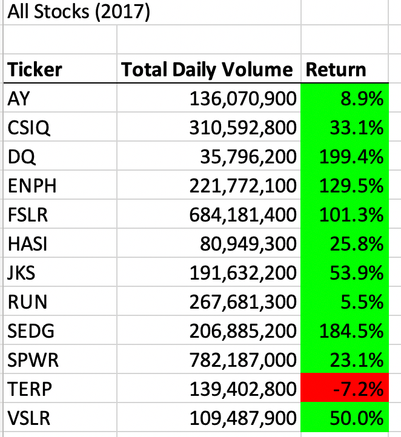
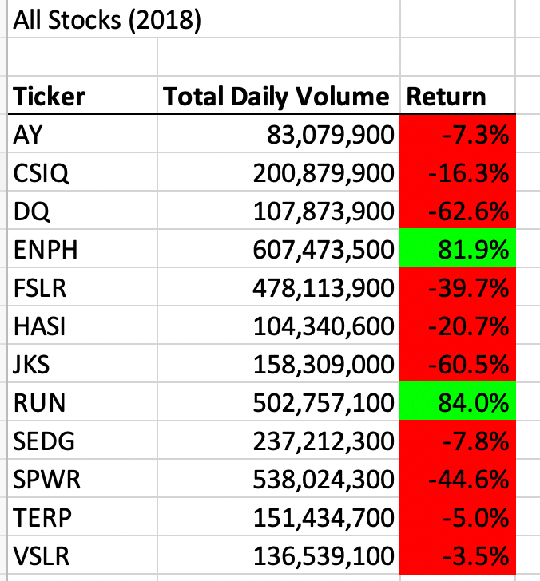
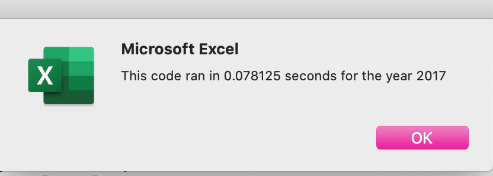
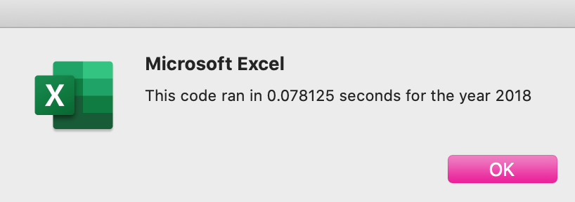

# Overview of Project
This project aims to provide the client - Steve - with data on the performance of 12 different stocks in 2017 and 2018. Steve's initial goal was to advise his parents on which green-friendly stocks they should invest in, but by the end of the project, he decided to expand the search to include the entire stock market over the last few years. The new request significantly expanded the amount of data the code would need to process through, so I refactored the first code used in the project to streamline it and speed up the run time. 

The list of stocks included: 

- AY
- CSIQ
- DQ
- ENPH
- FSLR
- HASI
- JKS
- RUN
- SEDG
- SPWR
- TERP
- VSLR

# Results
Overall, the data showed that most stocks performed better in 2017 than they did in 2018 with the exception of TERP, which was down 5.0% in 2017 versus being down 7.2% in 2017 – a difference of 2.2 percentage points. 

## 2017 Performance 
As you can see, most stocks – again, with the exception of TERP – were in the green (positive gains) for returns in 2017, with DQ delivering a return of 199.4% to its stockholders. 



## 2018 Performance
Based on our data, 2018 was much worse than 2017, with most stocks – with the exception of ENPH and RUN – falling in the red with negative returns.  



# Base Method, Refactoring and Formatting

First, I will outline the initial code, which acted as a basis for what would be the final, more efficient code, I'll then discuss how I refactored the initial code for efficiency and then touch on my approach to formatting the final spreadsheet and optimizing it for the end-user. 

## Base Method 

Using VBA, I first assigned an array for my 12 tickers and used the “As String” data type designation to clarify that the value would be letters. I then initialized variables for the starting and ending prices and assigned their data type as “Single” because the values for those would not exceed the 32-bit limitation and I did not need the precision of an operation such as “Double.” I then had to identify the correct data worksheet and make it active so that the script would pull from the correct source. 

I went on to calculate the row count ahead of setting up two “for” loops that would be key to make the script function. I set up a “for” loop labeled with “i” to loop through the 12 tickers by referencing the tickers(12) array that I previously set up and then I created another “for” loop using the row count calculation so that the script would look at all of the data from the first row where it occurs (row 2) to the final row where it occurs (row 3013) – this was labeled with “j.” I also set the total volume to zero so that volume would start from zero with each loop to correctly add the appropriate values based on each ticker.  

I then added three if/then statements to calculate the total volume, starting prices and ending prices. 

**Total Volume:** I indicated that if the value of a cell in the ticker column was indeed equal to a ticker, then total volume would be equal to its initial zero value *plus* the sum of the appropriate volume cells assigned to their specific ticker. 

**Starting Price:** I wrote a script to identify that when a ticker value was not equal to the value above it, but it *was* equal to the value below it, then the starting price would be equal to that first cell for a specific ticker, determined based on the close price column (in my case, that was column G, which was indicated by nine in the formula.)

**Ending Price:** The ending price script was very similar to the starting price script and I only had to adjust so that the script could identify that the ticker below was not equal to the value. 

Now that the code was written to calculate the appropriate values based on set parameters, I needed to identify where those calculations would go, so I reactivated the “All Stocks Analysis” sheet by using `Worksheets(“All Stocks Analysis”).Activate` and assigned the output destinations for each ticker. 

## Refactoring the Base Code 

I refactored the base code by focusing on nesting the loops. Similar to the base code, I set my array of tickers(12) and listed each value as a string, I also activated the appropriate data worksheet and identified the row count. Here is where the code began to change from the base: 
1.	I set the ticker index (`tickerIndex`) to 0 so that it would start from the first ticker “AY” when looping. 
2.	I created three output arrays for `tickerVolumes`, `tickerStartingPrices` and `tickerEndingPrices`. I set `tickerVolumes` to a long data type because it was likely to exceed the 32-bit limit for single types, while I set `tickerStartingPrices` and `tickerEndingPrices` as single data types since they would not exceed the limit. 
3.	I initialized the ticker volumes to zero by creating a “for” loop to function along with `tickerVolumes` throughout the data so that its value would begin at 0 for each new ticker. 
4.	I created another loop to loop through all the rows, just as I did with the base code.
5.	I then created if/then statements as I did with the base code, but this time, my output arrays were grouped with an identifier for each ticker – `tickerIndex` – so that the script to determine the values for all three of my arrays would just need to run through the rows once, rather than running through the rows 12 times as with the base code. 
6.	I finished this part of the code by setting the `tickerIndex` so that it would increase to the next index each time a new stock row was identified. 

The code ran for 2017 and 2018 data in about 0.5 seconds, but the refactored code ran faster – in about 0.07 seconds for each year. 


*Run-time for 2017 code*


*Run-time for 2018 code*

## Formatting and User Experience
When sending a product to a client, I want to make it as easy to read and use as possible. 

### Formatting 
I set a title for the target worksheet to indicate which year was being analyzed for all stocks (`Range("A1").Value = "All Stocks (" + yearValue + ")"`) as well as a row for headers to indicate which values would be populated: 
```
Cells(3, 1).Value = "Ticker"
Cells(3, 2).Value = "Total Daily Volume"
Cells(3, 3).Value = "Return"
```
I also wanted to put the headers in bold and underline their cells to make it clear that they were headers. 

More importantly with the formatting, I wanted to make it quick and easy for Steve to see which stocks saw gains in their returns and which ones did not. In that case, I used a loop combined with conditions so that cells with negative values would be filled red and cells with positive values would be filled green. That way, as soon as Steven runs the code, he'll immediately see which stocks performed relatively well and which ones didn't before even getting into the numbers. 

### User Experience
I knew that I wanted to make the document as easy as possible for Steve to read and navigate through, so I created an input box using the `InputBox` operator where Steve could enter the year he wants to see that would set the `yearValue` for the code to run through the correct source data sheet. 

I also included a timer operator to see how fast the code ran, though this is something I would likely remove before sending to Steve, as it does not contribute to his purpose for using the workbook, which is to analyze stocks. 

# Conclusion
Overall, refactoring the code streamlined the running of the script and made it run faster by nesting the loops. 

## Pros
Refactoring a code helps it run faster and better adapt should the data set significantly expand as Steve decided to do in the end. Additionally, refactoring code offers more practice and helps improve once's skills – refactoring could also lead to discovering more efficient ways to use certain codes for similar projects. 

## Cons
Refactoring a code can get time-consuming and possibly redundant by going over an existing code that works – particularly if you're on a short deadline, refactoring may not be a feasible option. Additionally, while refactoring helps a code adapt if a dataset expands, refactored code doesn't look like it can adapt if the end-user's goal changes, so having the base code might be more beneficial there since it's not compressed and could allow me to move around certain variable to meet the end-user's needs. 

